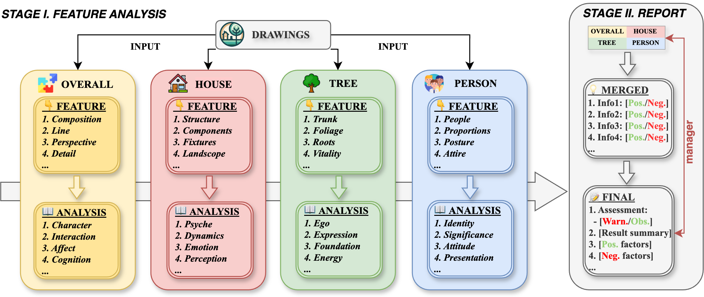
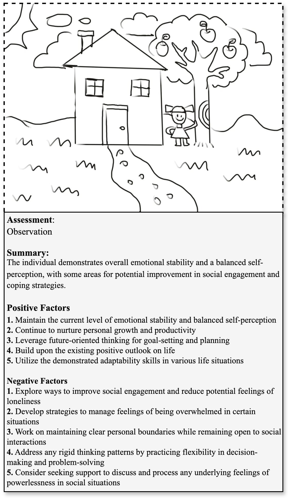
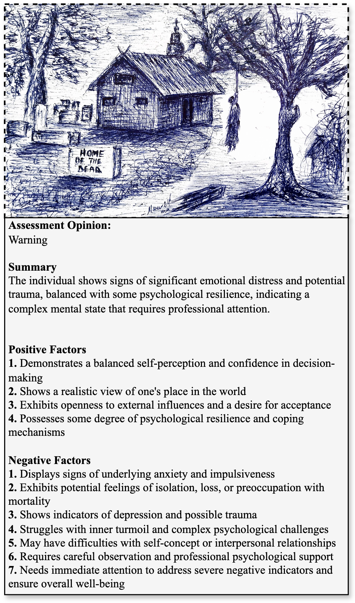

<p align="center">
  
</p>

<h1 align="center">PsyDraw: 留守児童のメンタルヘルススクリーニングのためのマルチエージェントマルチモーダルシステム</h1>

<p align="center">
  <a href="README.md">
    
  </a>
  <a href="README_CN.md">
    
  </a>
  <a href="README_JP.md">
    
  </a>
  <a href="LICENSE">
    
  </a>
  <a href="https://arxiv.org/abs/2412.14769">
    
  </a>
</p>

<p align="center">
  
</p>

## ⚠️ 重要な倫理的注意事項および専門的使用ガイドライン

**重要: このシステムは厳密に専門的なスクリーニング支援ツールとして設計されています。**

このリポジトリには、メンタルヘルス評価における倫理的考慮から、プロジェクトのコード構造のみが含まれています。システムのプロンプトおよび分析コンポーネントは、誤用を防ぎ、適切な適用を確保するためにオープンソース化されていません。

### 専門家のみ使用
- このツールは、資格を持つメンタルヘルス専門家（精神科医、心理カウンセラー、学校カウンセラー）が予備的なスクリーニングを支援するために設計されています。
- 資格のない個人が自己評価や相互評価に使用することは厳禁です。
- すべての結果は、資格を持つメンタルヘルス専門家によって解釈および検証される必要があります。

### 完全なシステムへのアクセス
研究または臨床目的で完全なシステム（プロンプトを含む）へのアクセスが必要な場合は、[project.htp@lyi.ai]までご連絡ください。アクセスは以下の条件を満たした後にのみ許可されます：
1. 専門資格の確認
2. 使用目的の審査
3. 倫理ガイドラインおよび使用条件への同意

### リスク防止
- 心理評価ツールの誤用は、誤った解釈や潜在的な有害な結果を引き起こす可能性があります。
- システムは、資格を持つ専門家の監督下でのみ専門的な環境で展開されるべきです。
- すべての実施は、メンタルヘルス評価に関連する倫理ガイドラインおよび規制に従う必要があります。

## プロジェクト概要
中国では、6600万人以上の留守児童が、親の出稼ぎによる深刻なメンタルヘルスの課題に直面しています。高リスクの留守児童を早期にスクリーニングし、特定することが重要ですが、特に農村部ではメンタルヘルス専門家の深刻な不足により、この作業は困難です。ハウス・ツリー・パーソン（HTP）テストは子供の参加率が高いものの、専門的な解釈が必要なため、資源の乏しい地域での適用が制限されています。この課題に対処するために、私たちはPsyDrawを提案します。これは、HTP描画を分析するためのマルチモーダル大規模言語モデルに基づくマルチエージェントシステムです。このシステムは、特徴抽出と心理的解釈のための専��エージェントを採用し、包括的な特徴分析と専門的なレポート生成の2段階で動作します。290人の小学生のHTP描画の評価では、71.03%の分析が専門家の評価と高い一致を示し、26.21%が中程度の一致を示し、わずか2.41%が低い一致を示しました。システムは、31.03%のケースで専門的な注意が必要であることを特定し、予備的なスクリーニングツールとしての有効性を示しました。現在、試験的に学校に導入されているPsyDrawは、特に資源が限られた地域でメンタルヘルス専門家を支援する可能性を示しており、心理評価の高い専門基準を維持しています。

<p align="center">
  
  <br>
  <em>図1: PsyDrawのワークフロー</em>
</p>

## ✨ 主な特徴

<p align="center">
  
  
  
  
</p>

## 🚀 クイックスタート

### インストール

1. リポジトリをクローン：
```bash
git clone https://github.com/LYiHub/psydraw.git
cd PsyDraw
```

2. 依存関係をインストール：
```bash
pip install -r requirements.txt
```

3. 環境変数を設定：
- `.env_example`ファイルをコピーして`.env`にリネーム
- APIキーとベースURLを記入

### 使用方法

<p align="center">
  
  
  
  
</p>

#### 1. 直接呼び出し
```bash
bash run.sh
# または
python run.py --image_file example/example1.png --save_path example/example1_result.json --language jp
```

#### 2. API統合
```bash
python deploy.py --port 9557
```
サービスは`http://127.0.0.1:9557`で実行されます

#### 3. ウェブデモ
```bash
bash web_demo.sh
# または
streamlit run src/main.py
```

#### 4. アプリケーションパッケージ化
```bash
pyinstaller htp_analyzer.spec
```

## 📊 ケーススタディ
<p align="center">
  
   
</p>

## ⚖️ ライセンス

このプロジェクトはGPL-3.0ライセンスの下でライセンスされています。詳細は[LICENSE](LICENSE)ファイルを参照してください。

## ⚠️ 免責事項

PsyDrawは厳密に専門的なスクリーニング支援ツールです。独立した診断ツールや専門的な医療評価の代替として使用することはできません。このシステムは、資格を持つメンタルヘルス専門家の専門知識を支援するために設計されています。システムの実装や使用は、専門家の監督下で行う必要があります。

## 📚 引用

この研究が役立つと感じた場合は、私たちの論文を引用してください：

```bibtex
@misc{zhang2024psydrawmultiagentmultimodalmental,
      title={PsyDraw: A Multi-Agent Multimodal System for Mental Health Screening in Left-Behind Children}, 
      author={Yiqun Zhang and Xiaocui Yang and Xiaobai Li and Siyuan Yu and Yi Luan and Shi Feng and Daling Wang and Yifei Zhang},
      year={2024},
      eprint={2412.14769},
      archivePrefix={arXiv},
      primaryClass={cs.CL},
      url={https://arxiv.org/abs/2412.14769}, 
}
```
